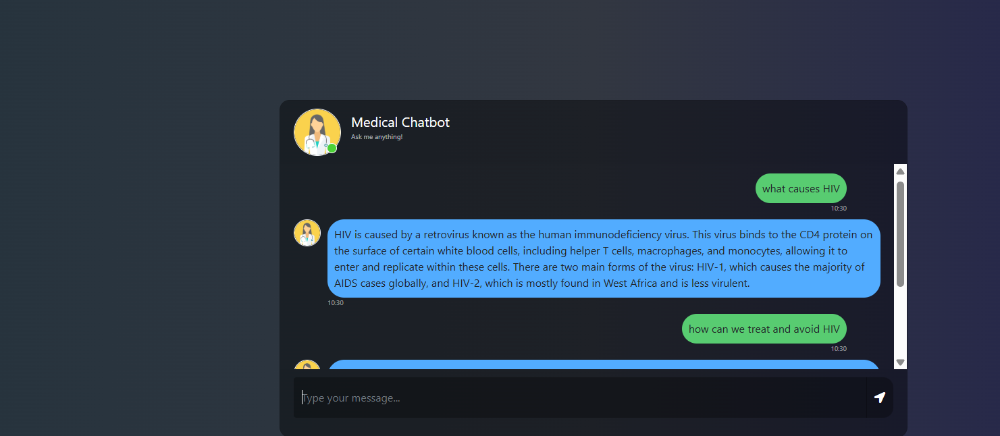
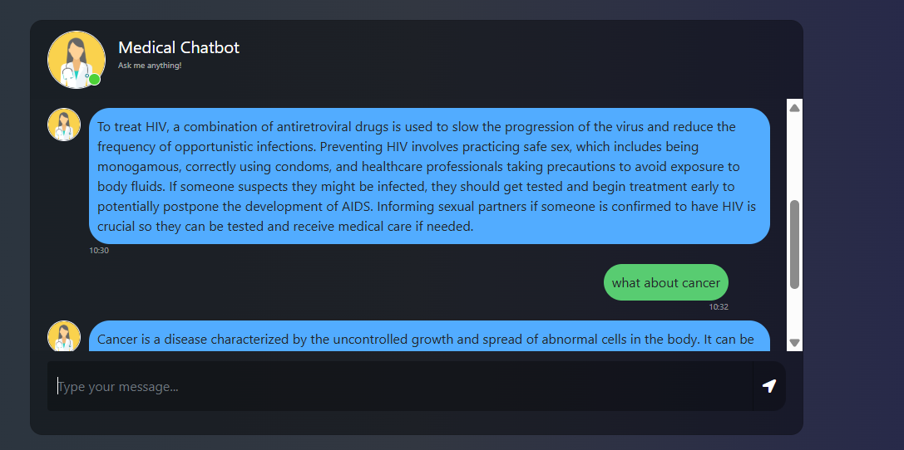

# Medical-Chatbot

A retrieval-augmented generation (RAG) chatbot that answers medical questions from a curated medical textbook, deployed to AWS through an automated CI/CD pipeline.



> **Disclaimer**
> This application is a technical demonstration of retrieval-augmented generation. It is not a medical device, it has not been clinically validated, and its responses must not be used for diagnosis or treatment decisions. Always consult a qualified healthcare professional.

## Purpose
General-purpose language models answer medical questions from parametric memory, which makes them prone to fabricating plausible-sounding clinical detail and impossible to audit. This project constrains the model to a specific corpus: a medical textbook is chunked, embedded, and stored in a vector database, and every answer is generated only from passages retrieved for that question. The system prompt instructs the model to decline when the retrieved context is insufficient rather than fill the gap from memory.

The result is a chatbot whose answers are traceable to source material, wrapped in a Flask web interface and shipped to EC2 as a container image on every push to `main`.

## Architecture


## How It Works

The system has two distinct flows.

**Indexing (offline, run once per corpus change)**
1. PDFs are loaded from `data/` with LangChain's directory loader.
2. Metadata is stripped back to the source filename to keep vector payloads small.
3. Documents are split into 500-character chunks with 25 characters of overlap.
4. Each chunk is embedded locally with a sentence-transformers model.
5. Vectors are upserted into a Pinecone serverless index.

**Retrieval (online, per user message)**
1. The user's question is embedded with the same model.
2. Pinecone returns the three most similar chunks by cosine similarity.
3. Those chunks are injected into the system prompt as context.
4. GPT-4o generates an answer constrained to that context.
5. The answer is returned to the browser and rendered in the chat interface.

Using the same embedding model on both sides is what makes the search meaningful — question and passage are projected into the same vector space, so similarity reflects semantic closeness rather than keyword overlap.

## Technologies Used
- **LangChain:** Orchestrates document loading, chunking, retrieval, and chain composition.
- **Pinecone:** Serverless vector database storing the embedded corpus.
- **sentence-transformers (all-MiniLM-L6-v2):** Local embedding model producing 384-dimensional vectors.
- **OpenAI GPT-4o:** Generation model, constrained to retrieved context.
- **Flask:** Web server and chat interface.
- **Docker:** Containerises the application for consistent deployment.
- **GitHub Actions:** CI/CD pipeline building to ECR and deploying to EC2.
- **Amazon ECR / EC2:** Container registry and hosting.

## Implementation

### Document processing — `src/utils.py`

Loading strips metadata down to the source filename. LangChain's PDF loader attaches page numbers, producer strings, and creation dates to every chunk; carrying that into the vector store inflates payload size without improving retrieval.

```python
def filter_to_key_contents(docs: List[Document]) -> List[Document]:
    """Reduce each Document to its content plus a single source field."""
    minimal_docs: List[Document] = []

    for doc in docs:
        source = doc.metadata.get("source")
        metadata = {"source": source} if source else {}

        minimal_docs.append(
            Document(page_content=doc.page_content, metadata=metadata)
        )

    return minimal_docs
```

Chunking uses a recursive splitter, which tries paragraph breaks before sentence breaks before arbitrary character cuts — so chunks tend to end at natural boundaries rather than mid-sentence.

```python
def text_split(extracted_data):
    text_splitter = RecursiveCharacterTextSplitter(
        chunk_size=500,
        chunk_overlap=25,
    )
    return text_splitter.split_documents(extracted_data)
```

The 25-character overlap means a sentence spanning a chunk boundary appears in both chunks, so a passage is not lost because it happened to straddle a split.

```python
def download_hugging_face_embeddings():
    return HuggingFaceEmbeddings(model_name='sentence-transformers/all-MiniLM-L6-v2')
```

Embedding runs locally rather than through an API. For a corpus of this size that removes a per-chunk cost and a rate limit from the indexing step, and keeps the document text on the machine doing the processing.

### Index construction — `pinecone_index.py`

The index is created only if absent, so re-running the script is safe.

```python
index_name = "medical-chatbot"

if not pc.has_index(index_name):
    pc.create_index(
        name=index_name,
        dimension=384,
        metric="cosine",
        spec=ServerlessSpec(cloud="aws", region="us-east-1"),
    )

docsearch = PineconeVectorStore.from_documents(
    documents=text_chunks,
    index_name=index_name,
    embedding=embeddings,
)
```

The dimension of 384 is not arbitrary — it is the output size of all-MiniLM-L6-v2. A mismatch here is rejected at upsert time, so the embedding model and the index are effectively coupled: changing the model requires rebuilding the index.

### The prompt — `src/prompt.py`

Three constraints do the work: answer only from context, decline when the context is insufficient, and stay brief.

```python
system_prompt = (
    "You are an AI Medical assistant for question-answering tasks. "
    "Use the following pieces of retrieved context to answer "
    "the question. If you don't know the answer, say that you "
    "don't know. Use four sentences maximum and keep the "
    "answer concise."
    "\n\n"
    "{context}"
)
```

The explicit permission to say "I don't know" matters more than it appears. Without it, a model handed thin context will still produce a confident answer — which in a medical setting is the worst possible failure mode.

### Retrieval chain — `web_app.py`

```python
docsearch = PineconeVectorStore.from_existing_index(
    index_name=index_name,
    embedding=embeddings
)

retriever = docsearch.as_retriever(search_type="similarity", search_kwargs={"k": 3})

chatModel = ChatOpenAI(model="gpt-4o")
prompt = ChatPromptTemplate.from_messages([
    ("system", system_prompt),
    ("human", "{input}"),
])

question_answer_chain = create_stuff_documents_chain(chatModel, prompt)
rag_chain = create_retrieval_chain(retriever, question_answer_chain)
```

`from_existing_index` connects to the already-populated index rather than rebuilding it, so application startup does not re-embed the corpus. `create_stuff_documents_chain` concatenates the retrieved chunks into the prompt; with `k=3` and 500-character chunks the context stays comfortably within limits.

The chat endpoint is deliberately thin:

```python
@app.route("/get", methods=["GET", "POST"])
def chat():
    msg = request.form["msg"]
    response = rag_chain.invoke({"input": msg})
    return str(response["answer"])
```

## Interface

The front end is a single-page chat built with Flask templates, jQuery, and Bootstrap.

<table>
<tr>
<td width="50%"></td>
<td width="50%"></td>
</tr>
</table>

## Deployment

Every push to `main` triggers a two-stage GitHub Actions workflow.

**Continuous Integration** runs on a GitHub-hosted runner: it authenticates to AWS, logs in to ECR, then builds and pushes the image.

```yaml
- name: Build, tag, and push image to Amazon ECR
  env:
    ECR_REGISTRY: ${{ steps.login-ecr.outputs.registry }}
    ECR_REPOSITORY: ${{ secrets.ECR_REPO }}
    IMAGE_TAG: latest
  run: |
    docker build -t $ECR_REGISTRY/$ECR_REPOSITORY:$IMAGE_TAG .
    docker push $ECR_REGISTRY/$ECR_REPOSITORY:$IMAGE_TAG
```

**Continuous Deployment** runs on a self-hosted runner installed on the EC2 instance, which is what allows the workflow to start a container on that machine without opening an SSH path from GitHub.

```yaml
- name: Run Docker Image to serve users
  run: |
    docker run -d \
      -e PINECONE_API_KEY="${{ secrets.PINECONE_API_KEY }}" \
      -e OPENAI_API_KEY="${{ secrets.OPENAI_API_KEY }}" \
      -p 8080:8080 \
      "${{ steps.login-ecr.outputs.registry }}"/"${{ secrets.ECR_REPO }}":latest
```

API keys are injected as environment variables from GitHub Secrets at container start, so no credential is ever written into the image or the repository.

## Repository Structure
```
Medical-Chatbot/
├── .github/workflows/
│   └── cicd.yaml              # Build to ECR, deploy to EC2
├── data/
│   └── Medical_Textbook.pdf   # Source corpus
├── src/
│   ├── utils.py               # Loading, filtering, chunking, embeddings
│   └── prompt.py              # System prompt
├── static/
│   └── style.css
├── templates/
│   └── chat.html              # Chat interface
├── research/
│   └── trials.ipynb           # Development notebook
├── pinecone_index.py          # One-off index builder
├── web_app.py                 # Flask application
├── Dockerfile
├── requirements.txt
└── setup.py                   # Makes src/ importable
```

## Development Setup

```bash
git clone https://github.com/IDOWUMAYOWA/Medical-Chatbot.git
cd Medical-Chatbot

conda create -n medibot python=3.10 -y
conda activate medibot

pip install -r requirements.txt
```

Create a `.env` file in the project root:

```
PINECONE_API_KEY=your_pinecone_key
OPENAI_API_KEY=your_openai_key
```

Place one or more medical PDFs in `data/`, then build the index. This runs once per corpus change and takes a few minutes depending on document size:

```bash
python pinecone_index.py
```

Start the application:

```bash
python web_app.py
```

Open `http://localhost:8081`.

### Docker

```bash
docker build -t medical-chatbot .
docker run -p 8081:8081 --env-file .env medical-chatbot
```

## Design Notes
- **Local embeddings, hosted generation.** Embedding runs on-device with a small open model; only the final generation call leaves the machine. This keeps indexing free and fast while still using a capable model for the answer.
- **Chunk size versus retrieval precision.** 500 characters is small enough that a retrieved chunk is mostly relevant to the question, and with `k=3` the model sees three focused passages rather than one long, diluted one. Larger chunks retrieve more context per hit but dilute the signal.
- **Cosine similarity.** Appropriate for sentence-transformer embeddings, which are normalised — direction carries the semantic meaning, magnitude does not.
- **Refusal as a feature.** The prompt's instruction to admit uncertainty is the main safety mechanism in the system. A RAG pipeline reduces hallucination but does not eliminate it, and a model that declines is preferable to one that improvises clinical detail.
- **Secrets never enter the image.** The Dockerfile carries no credentials; they arrive as runtime environment variables from GitHub Secrets.
